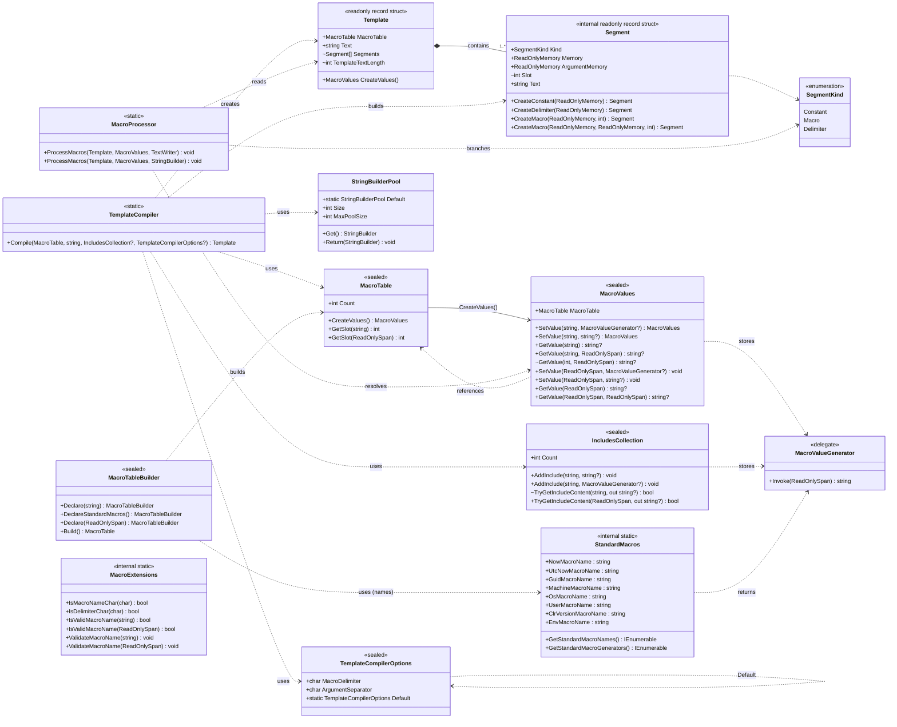
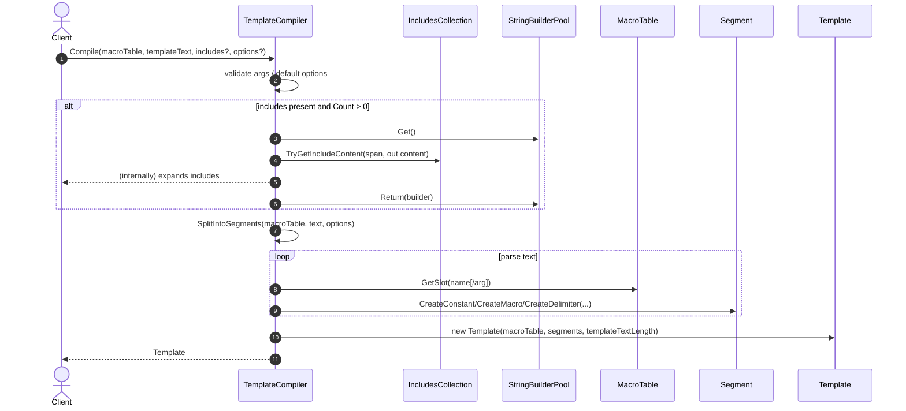
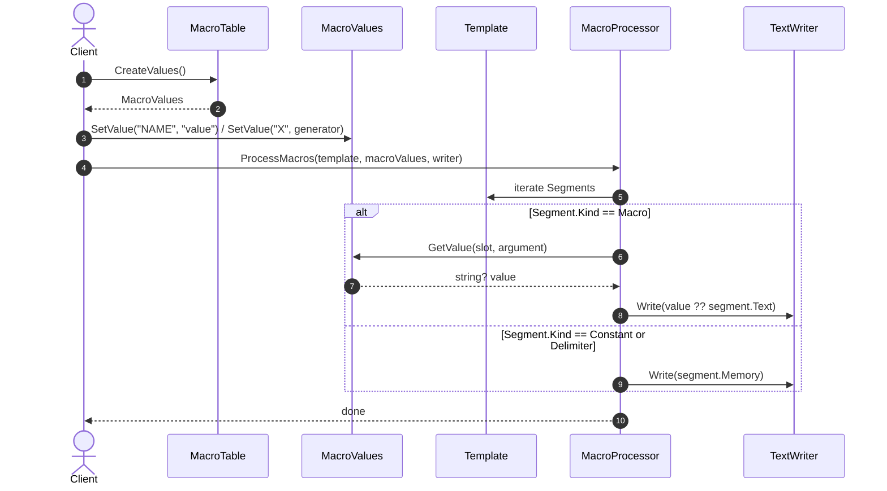

# Intercode.Toolbox.TemplateEngine

## Class Diagrams



## Sequence Diagrams

### Template Compilation



### Macro Processing



### Macro Table Building

```mermaid
sequenceDiagram
  autonumber
  actor Client
  participant MTB as MacroTableBuilder
  participant SM as StandardMacros
  participant MT as MacroTable

  Client->>MTB: new MacroTableBuilder()
  opt standard macros
    Client->>MTB: DeclareStandardMacros()
    MTB->>SM: GetStandardMacroNames()
    SM-->>MTB: names in fixed order
  end
  loop each declared name
    Client->>MTB: Declare(name)
  end
  Client->>MTB: Build()
  MTB->>MT: new MacroTable(macroSlots, hasStandard)
  MTB-->>Client: MacroTable
