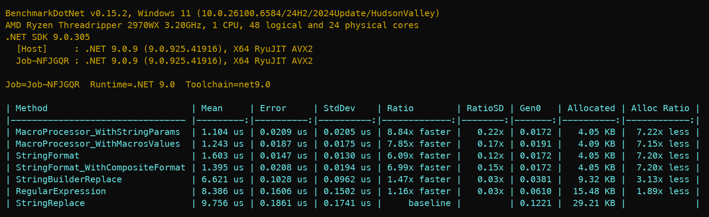

# Intercode.Toolbox.TemplateEngine

A fast, allocation-conscious text templating engine for .NET.

[](https://www.nuget.org/packages/Intercode.Toolbox.TemplateEngine)
[](LICENSE)

`## Table of Contents
  - [Overview](#overview)
  - [Quick Start](#quick-start)
  - [Concepts](#concepts)
  - [Step-by-Step](#step-by-step)
  - [Standard Macros (Built-in)](#standard-macros-built-in)
  - [Providing Values](#providing-values)
  - [Reference](#reference)
    - [TemplateCompilerOptions](#templatecompileroptions)
    - [MacroTableBuilder](#macrotablebuilder)
    - [MacroTable](#macrotable)
    - [MacroValueGenerator Delegate](#macrovaluegenerator-delegate)
    - [MacroValues](#macrovalues)
    - [TemplateCompiler](#templatecompiler)
    - [MacroProcessor](#macroprocessor)
    - [IncludesCollection](#includescollection)
    - [Template](#template)
    - [StringBuilderPool](#stringbuilderpool)
  - [Advanced Usage](#advanced-usage)
  - [Benchmarks](#benchmarks)
  - [Migrating from 2.x to 3.0](#migrating-from-2x-to-30)
  - [License](#license)

## Overview
A template is a string containing macros (placeholders) that are replaced at runtime with values. Example:

```
Hello, $Name$! Today is $NOW:yyyyMMdd$.
```

- Macro names are case-insensitive.
- Arguments (after a separator like `:`) are passed to dynamic macro generators.
- Standard macros (e.g., `NOW`, `GUID`) are always available and do not need to be declared.

## Quick Start

1. Install the [Intercode.Toolbox.TemplateEngine](https://www.nuget.org/packages/Intercode.Toolbox.TemplateEngine/) package .

   ```
   dotnet add package Intercode.Toolbox.TemplateEngine
   ```

2. Create a template, provide macro values, and process it. The most common approaches are shown below.

   1. Simplest flow (auto-declare macros while compiling)

      ```csharp
      // 1. Compile template (macros encountered in text are declared automatically)
      var template = TemplateCompiler.Compile(
        "Hello, $Name$! Today is $NOW:yyyyMMdd$. You are $Age$ years old!"
      );

      // 2. Provide values (static and/or dynamically generated)
      var values = template.CreateValues()
        .SetValue("Name", "John")
        .SetValue("Age", _ => Random.Shared.Next(18, 100).ToString());

      // 3. Process the template
      var text = template.ProcessMacros(values);
      ```

   1. Explicit macro declaration and shared macro table

      ```csharp
      // 1. Declare user macros
      var macroTable = new MacroTableBuilder()
        .Declare("Name")
        .Declare("Age")
        .Build();

      // 2. Compile template
      var template = TemplateCompiler.Compile(
        "Hello, $Name$! Today is $NOW:yyyyMMdd$. You are $Age$ years old!",
        macroTable
      );

      // 3. Provide values
      var values = macroTable.CreateValues()
        .SetValue("Name", "John")
        .SetValue("Age", _ => Random.Shared.Next(18, 100).ToString());

      // 4. Process the template
      var text = template.ProcessMacros(values);
      ```

   1. Static-only scenario (no dynamic generators), using `MacroValues` with static strings:
   
      ```csharp
      var table = new MacroTableBuilder()
        .Declare("Name")
        .Build();

      var template = TemplateCompiler.Compile("Hello, $Name$!", table);

      var values = table.CreateValues()
        .SetValue("Name", "World");

      var text = template.ProcessMacros(values);

      // Or use positional overloads for high-throughput scenarios
      var text2 = template.ProcessMacros("World");
      ```

> Choosing a `Compile` overload
> - `Compile(string text)`: Easiest on-ramp. Macros are auto-declared as they are encountered in the template. The declaration (slot) order follows the first occurrence of each macro placeholder in the template text after include expansion. Use `template.CreateValues()` to provide values. Good for one-off templates where you don’t need to share a macro table.
> - `Compile(string text, MacroTableBuilder builder, ...)`: Simplifies usage while still letting you accumulate macro declarations into a builder you control. Macros are declared into the builder in the order they first appear in the template text (post-include). Pass the same builder to multiple `Compile` calls to keep a shared mapping; slots are assigned in the sequence templates are compiled and, within each template, by first occurrence. Note that a new `MacroTable` instance is built for each compiled template. .
> - `Compile(string text, MacroTable macroTable, ...)`: Maximum control. You decide declaration order and reuse the same `MacroTable` across many templates. This guarantees consistent slot ordering and is recommended for high-throughput scenarios that must share values containers and avoid churn.

## Concepts

### Macro Declaration vs. Definition
- Declare macro names once; assign or change values as necessary without recompiling the template.
- Built-in standard macros are implicitly defined (no declaration required).
- Declaration Ownership:
  - Auto-declare during compile using `Compile(string text)` (order is first-encounter in text, after includes).
  - Use a `MacroTableBuilder` to collect declarations as templates are compiled (order is first-encounter per compiled template, after includes), then call `Build()` to produce a reusable `MacroTable`.
  - Supply a pre-built `MacroTable` to multiple `Compile` calls when you need consistent slot ordering across templates.

### Standard Macros
Built-in, dynamic macros are always available. See [Standard Macros](#standard-macros-built-in).

### Dynamic Macros
Dynamic macros defer value creation until expansion; they can incorporate timestamps, randomness, environment inspection, etc. Generators can read an optional argument to customize the generated value.

### Includes (Compile-Time Expansion)
Includes are macros that are substituted at compile-time. They are useful for static blocks (e.g., license headers, namespaces) that do not change per expansion and may contain run-time macros themselves.

### Arguments
Arguments are opaque to the engine—no parsing or validation is performed—so generators can interpret them according to domain rules (e.g., format strings or numeric bounds).

### Delimiters, Arguments and Escaping
- Macros are surrounded by the `TemplateCompilerOptions.MacroDelimiter` (default: `$`).
- Arguments are optional values that are separated from the macro name using the `TemplateCompilerOptions.ArgumentSeparator` (default `:`).
- Doubling the delimiter produces a literal instance, preventing accidental macro detection when the delimiter is present in the template text.

## Step-by-Step

### 1. Declare Macros
```csharp
var macroTable = new MacroTableBuilder()
  .Declare("Name")
  .Declare("Age")
  .Build();
```
Alternatively, use auto-declaration by compiling with `Compile(string text)` or track declarations by passing a `MacroTableBuilder`. In both cases, macros are declared in the order they are first encountered in the template text after include expansion.

### 2. Compile the Template Text
```csharp
var template = TemplateCompiler.Compile(
  "Hello, $Name$! Today is $NOW:yyyyMMdd$. You are $Age$ years old!",
  macroTable
);
```
With optional includes:
```csharp
var includes = new IncludesCollection();
includes.AddInclude("HEADER", "// <auto-generated>...</auto-generated>\n");
var template = TemplateCompiler.Compile("$HEADER$namespace $Name$;", macroTable, includes);
```
Or use auto-declaration:
```csharp
var template = TemplateCompiler.Compile("$HEADER$namespace $Name$;", includes);
```
Or accumulate declarations using a `MacroTableBuilder`:
```csharp
var builder = new MacroTableBuilder();
var template = TemplateCompiler.Compile("$HEADER$namespace $Name$;", builder, includes);
// Later, lock mapping:
var table = builder.Build();
```

### 3. Define Macro Values
```csharp
var values = macroTable.CreateValues()
  .SetValue("Name", "John")
  .SetValue("Age", _ => Random.Shared.Next(18, 100).ToString());
```
When using auto-declaration:
```csharp
var values = template.CreateValues()
  .SetValue("Name", "John")
  .SetValue("Age", _ => Random.Shared.Next(18, 100).ToString());
```

### 4. Process the Template
```csharp
var sb = new StringBuilder();
template.ProcessMacros(sb, values);
var text = sb.ToString();

// or
var text2 = template.ProcessMacros(values);
```

## Standard Macros (Built-in)
Standard macros are always available; you do not need to declare them. Names are case-insensitive.

- `NOW[:<format>]`
  - Emits the current local date/time.
  - Optional `format` is passed directly to `DateTime.ToString(format)`; example: `$NOW:yyyyMMdd$`.
- `UTC_NOW[:<format>]`
  - Emits the current UTC date/time.
  - Optional `format` behaves like `NOW`; example: `$UTC_NOW:O$`.
- `GUID[:<format>]`
  - Emits a newly generated GUID.
  - Optional `format` can specify standard GUID formats (e.g., `N`, `D`, `B`, `P`); example: `$GUID:N$`.
- `ENV:<variable>`
  - Reads an environment variable.
  - Argument is the variable name; if unset, emits an empty string; example: `$ENV:PATH$`.
- `MACHINE`
  - Emits the current machine name as returned by `Environment.MachineName`; no argument.
- `OS`
  - Emits the current Operating System as returned by `Environment.OSVersion.VersionString`; no argument.
- `USER`
  - Emits the current user name as returned by `Environment.UserName`; no argument.
- `CLR_VERSION`
  - Emits the current .NET runtime version as returned by `Environment.Version`; no argument.

> Note. Arguments are not parsed by the engine; they are passed to the macro generator as-is. 

---

## Providing Values

- Use `MacroValues` to bind static strings and/or dynamic generators per declared macro name or slot.
- For purely static scenarios where you already have values in positional order, use the positional 
  overloads of `MacroProcessor` that accept a `string?[]` or `ReadOnlySpan<string>`. The array/span 
  must have one entry per declared macro, ordered by declaration. Standard macros are resolved
  automatically and do not consume a slot.

---

## Reference

### TemplateCompilerOptions

#### Summary
Immutable configuration applied by the template compiler. Options instances can be cached and shared across threads.

#### Syntax
```csharp
public sealed class TemplateCompilerOptions
```

#### Constructors
- `TemplateCompilerOptions()` – Initializes with default settings (macro delimiter: `$`, argument separator: `:`).
- `TemplateCompilerOptions(char macroDelimiter, char argumentSeparator)` – Initializes with custom delimiter and separator. Throws if values are invalid or equal.

#### Fields
- `TemplateCompilerOptions Default` – Shared default options instance.

#### Properties

| Property | Type | Description |
|----------|------|-------------|
| `MacroDelimiter` | `char` | Gets the character used as the macro delimiter in the template engine. |
| `ArgumentSeparator` | `char` | Gets the character used to separate arguments within a macro. |

#### Usage Example
```csharp
var options = new TemplateCompilerOptions('#', '|');
var template = TemplateCompiler.Compile("#Name|formal#", options: options);
```

#### Remarks
- The delimiter and separator must not be alphanumeric, underscore, dash, or whitespace.
- The delimiter and separator must be different characters.

---

### MacroTableBuilder

#### Summary
Declares the list of user macro names permitted in a template set. Provides deterministic macro slot ordering.

#### Syntax
```csharp
public sealed class MacroTableBuilder
```

#### Constructors
- `MacroTableBuilder()` – Initializes a new instance.

#### Methods

| Method | Return Type | Description |
|--------|-------------|-------------|
| `Declare(string macroName)` | `MacroTableBuilder` | Registers a macro identifier (case-insensitive). Duplicate declarations are ignored. |
| `Declare(ReadOnlySpan<char> macroName)` | `MacroTableBuilder` | Registers a macro identifier using a span (optimized on .NET 9+ call sites). |
| `Build()` | `MacroTable` | Materializes an immutable macro name mapping table. |

#### Remarks
- Macro names are case-insensitive and can only contain alphanumeric, underscore, or dash characters.
- Standard macros are always available and do not need to be declared.
- If a macro with the same name as a standard macro is declared, the user-defined version takes precedence.
- When used via `TemplateCompiler.Compile(string text)` (implicit builder) or `TemplateCompiler.Compile(string text, MacroTableBuilder builder, ...)`, macros are declared in the order they are first encountered in the template text after include expansion. This order determines slot assignment.

---

### MacroTable

#### Summary
Immutable mapping from user macro name (case-insensitive) to a slot number.

#### Syntax
```csharp
public sealed class MacroTable
```

#### Properties

| Property | Type | Description |
|----------|------|-------------|
| `Count` | `int` | Number of declared user macros. |

#### Methods

| Method | Return Type | Description |
|--------|-------------|-------------|
| `CreateValues()` | `MacroValues` | Creates a `MacroValues` instance for the macro table. |
| `GetSlot(string macroName)` | `int` | Resolves the slot for a name; returns `0` if the name is unknown. |
| `GetSlot(ReadOnlySpan<char> macroName)` | `int` | Resolves the slot by span (optimized on .NET 9+ call sites). |

---

### MacroValueGenerator Delegate

#### Summary
User-provided callback that generates a dynamic value for a macro.

#### Syntax
```csharp
delegate string? MacroValueGenerator(ReadOnlySpan<char> argument);
```

#### Parameters
- `ReadOnlySpan<char> argument` – The macro argument from the template text; empty if no value was provided.

#### Returns
- `string?` – The generated macro value, or `null`.

---

### MacroValues

#### Summary
Mutable container binding user macro slots to static strings or generator delegates. Designed for rapid reassignment with minimal allocations.

#### Syntax
```csharp
public sealed class MacroValues
```

#### Properties

| Property | Type | Description |
|----------|------|-------------|
| `MacroTable` | `MacroTable` | The macro table associated with this values container. |

#### Methods

| Method | Return Type | Description |
|--------|-------------|-------------|
| `SetValue(string macroName, string? value)` | `MacroValues` | Associates a static string value with a macro by name; `null` clears the macro's value. |
| `SetValue(string macroName, MacroValueGenerator? generator)` | `MacroValues` | Associates a dynamic generator with a macro by name; `null` clears the macro's value. |
| `SetValue(int slot, string? value)` | `MacroValues` | Associates a static string with a macro by slot number; `null` clears the macro's value. |
| `SetValue(int slot, MacroValueGenerator? generator)` | `MacroValues` | Associates a dynamic generator with a macro slot by index; `null` clears the slot. |
| `SetValue(ReadOnlySpan<char> macroName, string? value)` | `MacroValues` | Associates a static value by span-based macro name (optimized on .NET 9+ call sites). |
| `SetValue(ReadOnlySpan<char> macroName, MacroValueGenerator? generator)` | `MacroValues` | Associates a dynamic generator by span-based macro name (optimized on .NET 9+ call sites). |
| `GetValue(string macroName, ReadOnlySpan<char> argument = default)` | `string?` | Fetches the value by macro name, invoking a dynamic generator if present. |
| `GetValue(int slot, ReadOnlySpan<char> argument = default)` | `string?` | Fetches the value by slot number. Returns `null` when not assigned or the slot is invalid. Negative slots resolve to standard macros. |
| `GetValue(ReadOnlySpan<char> macroName, ReadOnlySpan<char> argument = default)` | `string?` | Fetches the value by span-based macro name (optimized on .NET 9+ call sites). |

---

### TemplateCompiler

#### Summary
Converts the raw template text plus optional include expansions into a `Template` structure.

#### Syntax
```csharp
public static class TemplateCompiler
```

#### Methods

| Method | Return Type | Description |
|--------|-------------|-------------|
| `Compile(string text, MacroTable macroTable, IncludesCollection? includes = null, TemplateCompilerOptions? options = null)` | `Template` | Parses the template text into segments, performs include substitution (if provided), and resolves slots using the supplied `MacroTable`. Use when you want strict, shared ordering across templates. |
| `Compile(string text, MacroTableBuilder builder, IncludesCollection? includes = null, TemplateCompilerOptions? options = null)` | `Template` | Parses the template and declares any encountered macros into the provided builder in the order they first appear in the template (after include expansion), then builds a `MacroTable` for the returned `Template`. Pass the same builder to multiple calls to accumulate a shared mapping before calling `Build()`. |
| `Compile(string text, IncludesCollection? includes = null, TemplateCompilerOptions? options = null)` | `Template` | Convenience overload that auto-declares macros using an internal `MacroTableBuilder`. Macros are declared in the order they are first encountered in the template text after include expansion. Simplest usage; create values with `template.CreateValues()`. |

#### Remarks
- Choose the overload based on ownership of the macro table: auto-declare (simplest), builder (accumulate and later lock), or pre-built table (deterministic reuse across templates).

---

### MacroProcessor

#### Summary
Executes expansion by processing a compiled `Template` instance.

#### Syntax
```csharp
public static class MacroProcessor
```

#### Methods

| Method | Return Type | Description |
|--------|-------------|-------------|
| `ProcessMacros(this Template template, TextWriter writer, MacroValues macroValues)` | `void` | Streams expanded output to a `TextWriter`. Missing macro values produce empty strings. Exceptions thrown by generators are caught and their messages are emitted. |
| `ProcessMacros(this Template template, StringBuilder builder, MacroValues macroValues)` | `void` | Appends expanded output into a `StringBuilder`. |
| `ProcessMacros(this Template template, MacroValues macroValues)` | `string` | Expands the template and returns the resulting string using an internally pooled `StringBuilder`. |
| `ProcessMacros(this Template template, StringBuilder builder, params ReadOnlySpan<string?> values)` | `void` | Higher-performance, positional, static values variant; span length must be at least `MacroTable.Count`. Standard macros are resolved automatically. |
| `ProcessMacros(this Template template, StringBuilder builder, params string?[] values)` | `void` | Convenience overload for arrays. |
| `ProcessMacros(this Template template, params ReadOnlySpan<string?> values)` | `string` | Returns the expanded string using positional values and an internally pooled `StringBuilder`. |
| `ProcessMacros(this Template template, params string?[] values)` | `string` | Convenience overload for arrays using an internally pooled `StringBuilder`. |

#### Remarks
- Any exceptions thrown by generators are caught and their messages used as the macro substitution text.
- For positional overloads, pass values in the order you declared macros. Standard macros do not consume positions.

---

### IncludesCollection

#### Summary
Container for compile-time macro expansion. Supports static text or dynamic generators.

#### Syntax
```csharp
public sealed class IncludesCollection
```

#### Properties

| Property | Type | Description |
|----------|------|-------------|
| `Count` | `int` | Number of include entries tracked. |

#### Methods

| Method | Return Type | Description |
|--------|-------------|-------------|
| `AddInclude(string name, string? content)` | `void` | Adds or replaces a static include. A `null` content becomes an empty string at expansion. |
| `AddInclude(string name, MacroValueGenerator? generator = null)` | `void` | Adds or replaces a dynamic include whose content is generated at compile-time. A `null` generator produces an empty string. |

---

### Template

#### Summary
Represents a compiled template with its associated macro table and text. Provides access to the original template text and allows creation of macro value containers for expansion.

#### Syntax
```csharp
public readonly record struct Template
```

#### Properties

| Property | Type | Description |
|----------|------|-------------|
| `MacroTable` | `MacroTable` | The macro table associated with this template. |
| `Text` | `string` | The original template text (after include expansion, if any). |

#### Methods

| Method | Return Type | Description |
|--------|-------------|-------------|
| `CreateValues()` | `MacroValues` | Creates a new `MacroValues` instance associated with the template's macro table. |

---

## Advanced Usage
- Custom delimiters and separators:
  ```csharp
  var options = new TemplateCompilerOptions('#', '|');
  var template = TemplateCompiler.Compile("#Name|formal#", options: options);
  ```

- Dynamic macros with arguments:
  ```csharp
  var values = template.CreateValues()
    .SetValue("RightNow", arg => DateTime.Now.ToString(arg.IsEmpty ? "O" : arg.ToString()));
  ```

- Escaping delimiters: `$$` yields a literal `$` in output when `$` is the delimiter.

- High-throughput assignment using slots:
  ```csharp
  var nameSlot = template.MacroTable.GetSlot("Name");
  var values = template.CreateValues();
  values.SetValue(nameSlot, "John");
  values.SetValue(nameSlot, arg => expensiveComputation(arg));
  ```

- .NET 9+ optimized span-based APIs to avoid intermediate strings:
  ```csharp
  values.SetValue("Name".AsSpan(), "John");
  var value = values.GetValue("Name".AsSpan());
  ```

- Positional values (static-only hot paths):
  ```csharp
  // Values must be ordered as macros were declared; standard macros do not consume positions
  var text = template.ProcessMacros("Benchmark.Tests", "TestType", /* ... more values ... */);
  ```

---
## Benchmarks

The code was benchmarked using [BenchmarkDotNet](https://www.nuget.org/packages/BenchmarkDotNet). `MacroProcessor` demonstrates significantly faster performance and lower memory allocation compared to `StringBuilder.Replace`, regex, and naive string replacement. Using a pooled `StringBuilder` eliminates intermediate allocations and performs even better.

### Benchmark Setup

#### Template text

To benchmark the `TemplateEngine` we are going to parse the following template, taken from one of the standard templates
from the [Intercode.Toolbox.TypedPrimitives](https://www.nuget.org/packages/Intercode.Toolbox.TypedPrimitives/) package:
``` csharp
    // <auto-generated> This file has been auto generated by Intercode Toolbox Typed Primitives. </auto-generated>
    #nullable enable

    namespace $Namespace$;

    public partial class $TypeName$SystemTextJsonConverter: global::System.Text.Json.Serialization.JsonConverter<$TypeQualifiedName$>
    {
      public override bool CanConvert(
        global::System.Type typeToConvert )
      {
        return typeToConvert == typeof( $TypeQualifiedName$ );
      }

      public override $TypeQualifiedName$ Read(
        ref global::System.Text.Json.Utf8JsonReader reader,
        global::System.Type typeToConvert,
        global::System.Text.Json.JsonSerializerOptions options )
      {
        $TypeKeyword$? value = null;
        if( reader.TokenType != global::System.Text.Json.JsonTokenType.Null )
        {
          if( reader.TokenType == global::System.Text.Json.JsonTokenType.$JsonTokenType$ )
          {
            value = $JsonReader$;
          }
          else
          {
            bool converted = false;
            ConvertToPartial( ref reader, typeToConvert, options, ref value, ref converted );

            if ( !converted )
            {
              throw new global::System.Text.Json.JsonException( "Value must be a $JsonTokenType$" );
            }
          }
        }

        var result = $TypeQualifiedName$.Create( value );
        if( result.IsFailed )
        {
          throw new global::System.Text.Json.JsonException(
            global::System.Linq.Enumerable.First( result.Errors )
                  .Message
          );
        }

        return result.Value;
      }

      public override void Write(
        global::System.Text.Json.Utf8JsonWriter writer,
        $TypeQualifiedName$ value,
        global::System.Text.Json.JsonSerializerOptions options )
      {
        if ( value.IsDefault )
        {
          writer.WriteNullValue();
          return;
        }

        $JsonWriter$;
      }

      partial void ConvertToPartial(
        ref global::System.Text.Json.Utf8JsonReader reader,
        global::System.Type typeToConvert,
        global::System.Text.Json.JsonSerializerOptions options,
        ref $TypeKeyword$? value,
        ref bool converted );
    }
    
```

#### Macro values

And we are going to use the following macro values:

| Macro Name | Value |
|------------|-------|
| `Namespace` | `Benchmark.Tests` |
| `TypeName` | `TestType` |
| `TypeQualifiedName` | `Benchmark.Tests.TestType` |
| `TypeKeyword` | `string` |
| `JsonTokenType` | `String` |
| `JsonReader` | `reader.GetString()` |
| `JsonWriter` | `writer.WriteStringValue( value.Value )` |

#### Benchmark Code
Using [BenchmarkDotNet](https://benchmarkdotnet.org/)

```csharp
[Config( typeof( Config ) )]
[MemoryDiagnoser]
[HideColumns( "Job", "Median" )]
public partial class MacroProcessingBenchmarks
{
  // Removed for brevity. See content above.
  public const string TemplateText = "";


  // Removed for brevity. String.Format-compatible copy of TemplateText.
  public const string TemplateTextFormat = "";

  private readonly Template _template;
  private readonly MacroValues _dynamicMacroValues;
  private readonly CompositeFormat _compositeFormat;

  public MacroProcessingBenchmarks()
  {
    // Declare macro table
    var builder = new MacroTableBuilder();

    foreach( var (macroName, _) in Macros )
    {
      builder.Declare( macroName );
    }

    var macroTable = builder.Build();

    // Set macro values
    _dynamicMacroValues = macroTable.CreateValues();

    foreach( var (macroName, value) in Macros )
    {
      _dynamicMacroValues.SetValue( macroName, value );
    }

    // Compile templates
    _template = TemplateCompiler.Compile( TemplateText, macroTable );
    _compositeFormat = CompositeFormat.Parse( TemplateTextFormat );
  }

  public static IReadOnlyDictionary<string, string> Macros =>
    new Dictionary<string, string>
    {
      { "Namespace", "Benchmark.Tests" },
      { "TypeName", "TestType" },
      { "TypeQualifiedName", "Benchmark.Tests.TestType" },
      { "TypeKeyword", "string" },
      { "JsonTokenType", "String" },
      { "JsonReader", "reader.GetString()" },
      { "JsonWriter", "writer.WriteStringValue( value.Value )" }
    };

  [Benchmark]
  public string MacroProcessor_WithStringParams()
  {
    return _template.ProcessMacros(
      "MyApp.Primitives",
      "Type",
      "MyApp.Primitives.Type",
      "string",
      "String",
      "reader.GetString()",
      "writer.WriteStringValue( value.Value )"
    );
  }

  [Benchmark]
  public string MacroProcessor_WithMacrosValues()
  {
    return _template.ProcessMacros( _dynamicMacroValues );
  }

  [Benchmark]
  public string StringFormat()
  {
    return string.Format(
      TemplateTextFormat,
      "MyApp.Primitives",
      "Type",
      "MyApp.Primitives.Type",
      "string",
      "String",
      "reader.GetString()",
      "writer.WriteStringValue( value.Value )"
    );
  }

  [Benchmark]
  public string StringFormat_WithCompositeFormat()
  {
    return string.Format(
      CultureInfo.InvariantCulture,
      _compositeFormat,
      "MyApp.Primitives",
      "Type",
      "MyApp.Primitives.Type",
      "string",
      "String",
      "reader.GetString()",
      "writer.WriteStringValue( value.Value )"
    );
  }

  [Benchmark]
  public string StringBuilderReplace()
  {
    var sb = new StringBuilder( TemplateText );

    foreach( var (macro, value) in Macros )
    {
      sb.Replace( macro, value );
    }

    return sb.ToString();
  }

  [Benchmark]
  public string RegularExpression()
  {
    return CreateMacroNameRegex()
      .Replace(
        TemplateText,
        match =>
        {
          var key = match.Groups[1].Value;
          return Macros.TryGetValue( key, out var value ) ? value : match.Value;
        }
      );
  }

  [Benchmark( Baseline = true )]
  public string StringReplace()
  {
    var result = TemplateText;

    foreach( var (macroName, value) in Macros )
    {
      result = result.Replace( $"${macroName}$", value, StringComparison.OrdinalIgnoreCase );
    }

    return result;
  }

  private class Config: ManualConfig
  {
    public Config()
    {
      SummaryStyle = SummaryStyle.Default.WithRatioStyle( RatioStyle.Trend );
    }
  }

  [GeneratedRegex( @"\$([^$]+)\$" )]
  private static partial Regex CreateMacroNameRegex();
}

```

#### Benchmark Results

As the results indicate, `MacroProcessor` demonstrates significantly faster performance and lower memory allocation compared to 
the `String.Format`, `CompositeFormat`, `StringBuilder`, `Regex`, and `String Replace` implementations. This performance increase
is even more dramatic when using a pooled `StringBuilder`. 



## Migrating from 2.x to 3.0

| 2.x Concept / API | 3.0 Replacement | Notes |
|-------------------|-----------------|-------|
| `TemplateEngineOptions` | `TemplateCompilerOptions` | Use constructor overloads for configuration. |
| `TemplateCompiler compiler = new(); compiler.Compile(text)` | `TemplateCompiler.Compile(text, macroTable, includes, options)` or `TemplateCompiler.Compile(text, builder, includes, options)` or `TemplateCompiler.Compile(text, includes, options)` | Static; choose overload based on macro table ownership. |
| `MacroProcessorBuilder` | `MacroTableBuilder` + `MacroTable.CreateValues()` | Separation of declaration and values. |
| `builder.AddStandardMacros()` | (Removed) | Standard macros are always available; no declaration required. |
| `builder.AddMacro("Name", "John")` | `values.SetValue("Name", "John")` | Must declare first (unless using auto-declare overload). |
| `builder.AddMacro("Rand", _ => ...)` | `values.SetValue("Rand", span => ...)` | Delegate signature uses `ReadOnlySpan<char>`. |
| `processor.ProcessMacros(template, writer)` | `template.ProcessMacros(writer, values)` | Extension method on `Template`; note parameter order. |
| `processor.GetMacroValue("Name")` | `values.GetValue("Name")` | Value access moved. |
| (No includes feature) | `IncludesCollection` | New compile-time expansion. |
| (N/A) | Positional values overloads | For static-only high-throughput scenarios. |

## License
This project is licensed under the MIT License. See `LICENSE` for details.
